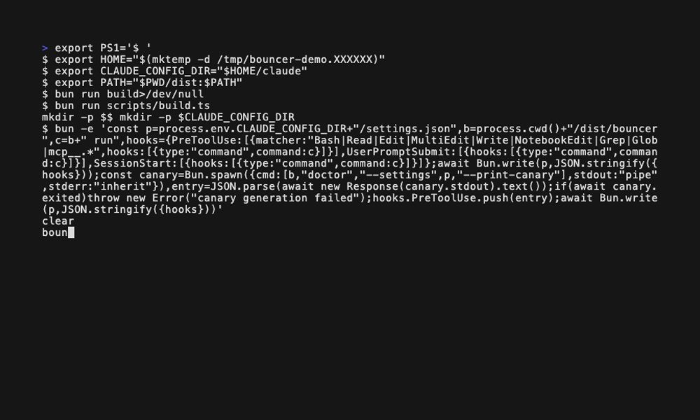
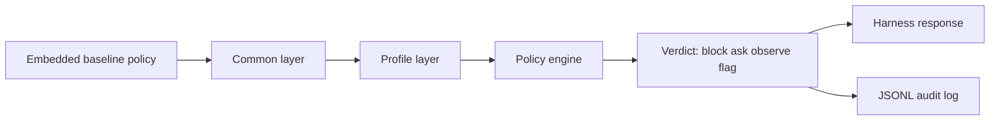

# bouncer
[](https://github.com/jrobic/agent-bouncer/actions/workflows/verify.yml)

`bouncer` is one standalone binary that guards coding-agent tool calls before
they run: destructive commands, protected writes, secret reads, MCP writes,
and prompt-injection signatures.

## At a glance

- Guards [Claude Code, Codex, and pi/omp](#harnesses) today.
- Install with `brew install jrobic/tap/bouncer` (or build from a checkout), then follow a wiring how-to.
- Verify what you run: [`bouncer --version`](#trust), `dist/bouncer.sha256`, and the policy digest.


<!-- demo:start -->
```console
$ bouncer check "rm -rf /"
block [rm-rf-dangerous] rm -rf targeting a dangerous path: / → deny (claude-code)
$ bouncer check "git push --force origin main"
confirm [git-protected] git push can rewrite history, mutate a remote, or discard work — confirm before running → ask (claude-code)
$ bouncer check "cat ~/.ssh/id_ed25519"
block [bash-ssh-key] Bash command references sensitive path: SSH key file blocked → deny (claude-code)
$ bouncer check "echo x > ~/.zshrc"
confirm [bash-shell-rc] Bash write target protected by shell-rc: Shell startup files execute commands in future terminal sessions → ask (claude-code)
$ bouncer check "ls -la"
allow
```
<!-- demo:end -->



*Terminal recording: a deny, an ask, a blocked secret read, an allow, and
`doctor` on a wired profile; recorded at `8d2d88c`.*

## Harnesses

This matrix is derived from [`policy/harness/*.toml`](policy/harness/) and
checked against `bouncer harness list`. Adapted harnesses receive a verdict;
writes to declared-only harnesses' configuration directories are guarded, but
they have no verdict transport yet.

| Harness | Wiring | Transport | Status | Confirm verdict |
| --- | --- | --- | --- | --- |
| Claude Code | `hook-file` | `stdin-json` | adapted | `ask` |
| Codex CLI | `codex-hooks` | `stdin-json` | adapted | `deny` |
| pi-agent and omp | `shim-file` | `stdin-json` | adapted | `ask` |
| OpenCode | — | `none` | declared only | none |
| Gemini CLI | — | `none` | declared only | none |
| Cursor | — | `none` | declared only | none |

## Install and wire

On macOS Apple Silicon or Linux x64, install the current release from Homebrew:

```sh
brew install jrobic/tap/bouncer
```

On other platforms, build from a checkout. [Install bouncer](docs/how-to/install.md)
covers both paths, checksum verification, and the stable path to wire.

Then wire the installed binary into your adapted harness and verify it:

- [Claude Code](docs/how-to/wire-into-claude-code.md)
- [Codex CLI](docs/how-to/wire-into-codex.md)
- [pi-agent and omp](docs/how-to/wire-into-pi-agent.md)

```sh
bouncer doctor
```

## Tune the policy with an agent

`bouncer-policy` turns an explicit human request or audit suggestion into a
reviewed workstation overlay change. It selects the narrowest lever, shows the
complete TOML and blast radius, and proves the result with lint, provenance,
and the original verdict.

It has two gates: an explicit in-session `go` before a policy mutation, then
the `bouncer-policy` protection on that mutation. The latter can deny under a
harness that cannot ask; the skill then prints the approved block and the
path-specific command for the human to paste.

```sh
mkdir -p <skills-dir>/bouncer-policy && bouncer skill policy > <skills-dir>/bouncer-policy/SKILL.md
```

| Harness | Skills directory | Verification |
| --- | --- | --- |
| Claude Code | `~/.claude/skills` (shared by every profile) | [Claude Code skills](https://code.claude.com/docs/en/skills) |
| Codex CLI | `~/.agents/skills` | [OpenAI skills](https://learn.chatgpt.com/docs/build-skills#where-codex-loads-local-skills) |
| pi-agent | `~/.pi/agent/skills` | [Pi skills](https://badlogic-pi-mono.mintlify.app/coding-agent/skills#skill-locations) |
| omp | `~/.omp/profiles/<profile>/agent/skills` | [OMP skill discovery](https://github.com/can1357/oh-my-pi/blob/main/packages/coding-agent/src/discovery/builtin.ts) |
On Codex, the description is the only explicit-invocation guard unless the human adds `policy.allow_implicit_invocation: false` to `agents/openai.yaml` beside the skill file.
For one project only, install the skill in `.claude/skills/bouncer-policy/` in that project.


Reprint the skill after each bouncer upgrade. The [custom-rule](docs/how-to/add-a-custom-rule.md),
[override](docs/how-to/override-a-baseline-rule.md), and
[audit-tuning](docs/how-to/tune-rules-with-audit.md) how-tos remain the
background reference.


## Trust

`bouncer` identifies both the binary and its embedded policy. The text
line and JSON form expose the version, build provenance, and baseline policy
digest; the checksum verifies the compiled artifact before installation.

<!-- trust:start -->
Example values for a compiled binary; `sha` and `date` vary by build:
```console
$ bouncer --version
bouncer 1.2.0 (example build SHA, built example UTC time) baseline 0b41bf352a2a
$ bouncer --version --json
{"name":"bouncer","version":"1.2.0","build":{"sha":"example build SHA","dirty":false,"date":"example UTC time"},"policy":{"baseline":"0b41bf352a2a"}}
$ shasum -a 256 -c dist/bouncer.sha256
dist/bouncer: OK
```
<!-- trust:end -->

The baseline is compiled into the binary, then local common and profile layers
are merged in order. A malformed layer is rejected rather than partially
applied; the remaining policy continues fail-closed. [`run`](docs/reference/cli.md#run)
reads stdin and local policy files, writes guarded verdicts to the local JSONL
[audit log](docs/reference/audit-log.md), and makes no network request in the decision path.

Read [ADR-0003](docs/adr/0003-liveness-fail-closed-in-three-layers.md) for the
three fail-closed layers, [the policy reference](docs/reference/policy.md) for
the policy digest and merge rules, and
[ADR-0006](docs/adr/0006-declarative-harness-adapters.md) for harness adapters.

## Policy layers



Scope: policy loading and verdict routing. Sources:
[`src/policy/load.ts`](src/policy/load.ts),
[policy layers](docs/reference/policy.md#baseline-vs-overlay), and
[ADR-0001](docs/adr/0001-layered-policy-common-then-profile.md). Inspected at
`49b5caf`.

An embedded baseline is merged with the common layer, then the profile layer.
The engine returns a harness response and records guarded verdicts in JSONL.

## Why use bouncer beside declarative permissions?

| Concern | bouncer | Declarative `permissions` alone |
| --- | --- | --- |
| Failure behavior | A canary, launcher, and declarative layer provide three fail-closed checks. [ADR-0003](docs/adr/0003-liveness-fail-closed-in-three-layers.md) | A permissions decision can stop a call before hooks run, so it does not check hook wiring. [Shadow mode](docs/how-to/wire-into-claude-code.md#shadow-first-recommended-before-cutover) |
| Matching | Regex rule rows and named structural algorithms evaluate the tool input. [Policy reference](docs/reference/policy.md#the-rule-row-id-regex-reason-flags-except-special-verdict) | A short-circuited call never reaches bouncer's matchers. [Shadow mode](docs/how-to/wire-into-claude-code.md#shadow-first-recommended-before-cutover) |
| Audit trail | Guarded verdicts are written to an account-local JSONL log. [Audit log](docs/reference/audit-log.md) | A permissions short-circuit is invisible to bouncer's audit log. [Shadow mode](docs/how-to/wire-into-claude-code.md#shadow-first-recommended-before-cutover) |
| Shadow migration | `--shadow` evaluates and logs without writing a verdict to stdout. [Shadow mode](docs/how-to/wire-into-claude-code.md#shadow-first-recommended-before-cutover) | Calls stopped by permissions cannot appear in bouncer's shadow comparison. [Shadow mode](docs/how-to/wire-into-claude-code.md#shadow-first-recommended-before-cutover) |
| Policy changes | The embedded baseline accepts common and profile overlays with explicit reasons and precedence. [ADR-0001](docs/adr/0001-layered-policy-common-then-profile.md) | In Claude Code, `settings.json` `permissions` short-circuits a call before `PreToolUse`; that call does not reach bouncer. [Shadow mode](docs/how-to/wire-into-claude-code.md#shadow-first-recommended-before-cutover) |

## Documentation

| I want to... | Read |
| --- | --- |
| install bouncer | [Install](docs/how-to/install.md) |
| build and publish a release | [Release](docs/how-to/release.md) |
| wire bouncer into a Claude Code session | [Wire into Claude Code](docs/how-to/wire-into-claude-code.md) |
| wire bouncer into Codex CLI | [Wire into Codex CLI](docs/how-to/wire-into-codex.md) |
| wire bouncer into pi-agent or omp | [Wire into pi-agent and omp](docs/how-to/wire-into-pi-agent.md) |
| add a rule of my own | [Add a custom rule](docs/how-to/add-a-custom-rule.md) |
| disable, soften, or safely widen a baseline rule | [Override a baseline rule](docs/how-to/override-a-baseline-rule.md) |
| find recurring friction and dead rules | [Tune rules with the audit log](docs/how-to/tune-rules-with-audit.md) |
| tune the policy with an agent | [`bouncer-policy`](skills/bouncer-policy/SKILL.md) |
| look up a subcommand's flags, output, or exit code | [CLI reference](docs/reference/cli.md) |
| look up the TOML policy format | [Policy reference](docs/reference/policy.md) |
| inspect the audit log's JSONL shape | [Audit log reference](docs/reference/audit-log.md) |
| report a vulnerability | [Security](SECURITY.md) |

## Provenance

These guards were initiated and designed by Jonathan Robic, evolved across
two prior private codebases (a workstation hook set and a catalog
generation) that this repository unifies.

## License

MIT — see [LICENSE](LICENSE).

## Status

Version 1.2.0. The [Homebrew tap](https://github.com/jrobic/homebrew-tap)
installs macOS Apple Silicon and Linux x64 releases; GitHub Releases attach
matching `.tar.gz` archives and SHA-256 checksums. Building from a checkout
also works. See [Install](docs/how-to/install.md) and [Release](docs/how-to/release.md).
